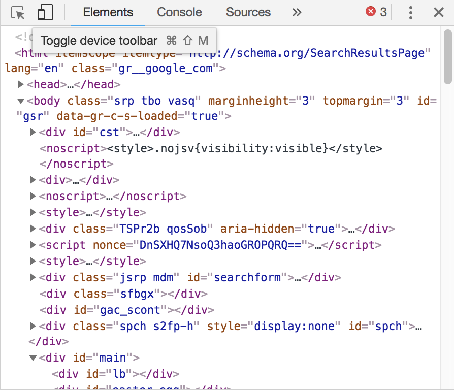

# HackSchool Session 1: Introduction to Web Development
**Location**: Covel 227
**Time**: 6-8pm

**Teachers**
* Kristie Lim
* Prateek Singh

# Resources

**Slides**
* [Session 1 - Introduction to Web Development](http://tinyurl.com/hackschool2018-1)

**ACM Membership Attendance Portal**
* [Portal](http://members.uclaacm.com/login)

**Questions**
* [Ask your question here!](http://goo.gl/forms/xyeFXLx9mrAXolCG3)


# What we'll be learning today

* Basic Dev Environment Setup
* Basic Web Structure
  * Frontend
  * Backend
* HTML
* CSS

## Basic Dev Environment Setup
### 1. Browser with a debugger
Get [Google Chrome](https://www.google.com/chrome/).

### 2. Text Editor
There is NO best editor for everyone. There is only the best editor for yourself.
Here are some common ones that people use.

Get [Sublime Text](https://www.sublimetext.com/).

Get [VS Code](https://code.visualstudio.com/).

Get [Atom](https://atom.io/).

## Basic Web Structure
### Frontend
"Frontend" is "what is being shown in the browser". It usually refers to the **user interface** (UI). **Client-side** code are written by "frontend developer". The fundamental languages of the frontend are **HTML**, **CSS** and **JavaScript**.

### Backend 
"Backend" is "what is should be sent to the browser".
It is where all the logic of the site sits. **Server-side** code are written by "backend develper"


## HTML (Hyper Text Markup Language)

### HTML Setup

Create a `index.html` file and put in these codes.
```HTML
<!DOCTYPE html>
<html>
<head>
	<title>Landing page</title>
</head>
<body>
	// Stuff will go here!
</body>
</html>
```
- `<!DOCTYPE html>` lets the browser know it’s an HTML doc
- `<html>` and `</html>` tags denote where the content of HTML goes
- `<head>` tag includes information that isn’t displayed, such as the title of the webpage
- `<title>` tag defines a title for the page used in the browser toolbar and search results
- `<body>` tag surrounds all visible content. Put all visible content in here.

### **Tag**: Header
```HTML
<h1> HELLO WORLD </h1>
```
><h1> HELLO WORLD </h1>
- A **header** tag can be from `h1`-`h6`, with 1 being the most important/largest, to 6 being the least important/smallest
- Use header tags to express section headers and other important information

### **Pitfall**: New Lines and spaces 

```HTML
<!-- Example 1 -->
<h2>
  HELLO WORLD
</h2>

<!-- Example 2 -->
<h2> HELLO WORLD </h2>

<!-- Exmaple 3 -->
<h2> HELLO      WORLD </h2>
```

- The above code are exactly the same
- New lines and spaces does not matter

### **Tag**: Image
```HTML

```
> 

- Use `img` tag to insert image
- the `src` attribute specify a URL to the image, which can be local or online

### **Tag**: Paragraph
```HTML
<p>I am a paragraph</p>
```
> <p>I am a paragraph</p>

### **Tag**: Ordered List
```HTML
<ol>
  <li>First ordered list item</li>
  <li>Second ordered list item</li>
</ol>
```
> <ol> <li>First ordered list item</li> <li>Second ordered list item</li> </ol>

- There is also unordered list with tag `<ul>`. Items are still marked with `<li>`

### **Tag**: Button
```HTML
<button>Click Me</button>
```
> <button>Click Me</button>

### **Tag**: Links
```HTML
<a href="http://acm.cs.ucla.edu/">ACM Website!</a>
```
> <a href="http://acm.cs.ucla.edu/">ACM Website!</a>
- The `href` attribute specifies the URL 

### **Tag**: Inputs
```HTML
<input types="text" placeholder="input stuff here">
```
><input types="text" placeholder="input stuff here">
- The `<input>` tag is used to gather input from users.
- The `types` attribute specifies the type of input. It can be “text”, “number”, or “submit” based on what you want the user to input.


## CSS (Cascading Style Sheet)

CSS is the style specifying code for HTML files. They have a completely different syntax compared to HTML.

### **Stylish**: Create and Link your CSS file to HTML
- Create a file named `style.css`. Under the same directory as your HTML file.
```HTML
<!-- Inside the head tag -->
<link rel="stylesheet" type="text/css" href="style.css">
```
- You can also directly put all CSS code in a `<style>` tag. But seperating them into two files is cleaner.

### **About Selection**: Class and ID
All HTML tags have the attribute `class` and `id`. These 2 attributes can be used by CSS code to target the element to add style to.

You can add `class` or `id` to an element like this.

```HTML
<h1 class="header"> HELLO WORLD </h1>

<p id="my-paragraph">I am a paragraph</p>
```

Now we get select the element that we want to add style to with `class` and `id`.

```CSS
#my-paragraph {
  color: red;
}
```
- To select `id`, we use the format `#id`.

```CSS
.header {
  color: blue;
}
```
- To select `class`, we can use `.classname`.

```CSS
img {
  width: 200px;
}
```
- We can also select stuff with element name. Our image is probably too big. Let's size it down a little bit.

- However, all other images you add would also have the same styling applied to them if you select by element name. You probably should avoid this in practice. 

- Also, notice the aspect ratio. It is kept the same even we only set the width.

```CSS
* {
  border: 2px solid aquamarine;
}
```
- We can select everything with the `*` operator


### **Stylish**: Text Properties

```CSS
.header {
  color: blue;
  /* the following are some text-related properties */
  text-align: right;
  font-weight: bold;
}
```
- [`text-align`](https://www.w3schools.com/cssref/pr_text_text-align.asp) defines how the text is aligned.
- try changing `text-align` to `center`/`left`/`justify` and see what happens.
- [`font-weight`](https://www.w3schools.com/cssref/pr_font_weight.asp) defines how thick or thin the text is going to be.

### **Stylish**: Formatting Properties

```CSS
button {
  padding: 10px;
}
```
- The [`padding`](https://www.w3schools.com/css/css_padding.asp) property is used to generate space around an element's content, inside of any defined borders.

```CSS
button {
  /* padding: 10px; */
  /* changed from padding to margin */
  margin: 10px;
}
```
- The [`margin`](https://www.w3schools.com/css/css_margin.asp) property is used to create space around elements, outside of any defined borders.

- Can you see the difference between `padding` and `margin`? `padding` adds space "inside" while `margin` adds "outside".


## JS (JavaScript)

### What is DOM (Document Object Model)? 

- Let's check it out in the broswer
- Left click on any page. Click `Inspect`.
- You should see something like this.



- This is the "HTML representation" of the DOM. 
- We can manipulate the DOM through JavaScript

### **Manipulate**: Create a JavaScript file and link it to your HTML
- Create a file named `script.js`. Under the same directory as your HTML file.
```HTML
<!-- Inside the body tag -->
<script src="script.js"></script>
```
- You can also put all the JavaScript code within the `script` tag. 


### **Manipulate**: Click and Open Sesame

In your `index.html` file, 
```HTML
<li id="last">Second ordered list item</li>
```

In your `script.js` file,
```javascript
document.getElementById('last').onclick = () => {
	document.getElementById('last').innerHTML = 'Secret message';
};
```
- The `() => {}` syntax is a fancy way to declare function. Don't worry. We will be covering those later.
- `document` is another global variable that represents the DOM.
- The first line is saying "after the `window` has loaded (`onload`), execute the following function".
- The second and third line means "for the element with id `last` from the DOM (`document`), and when it is clicked (`onclick`), we change its `innerHTML` content to 'Secret message'.
