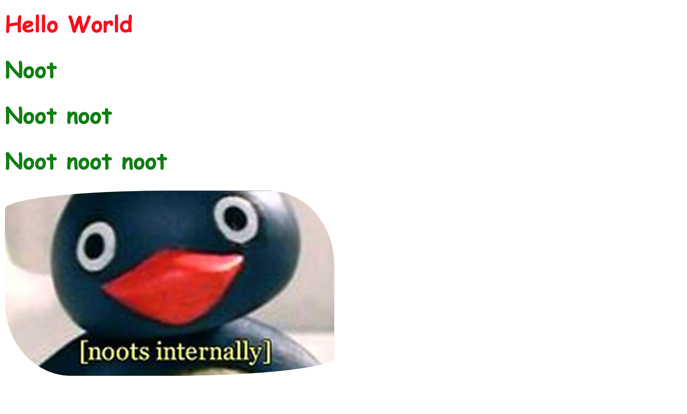
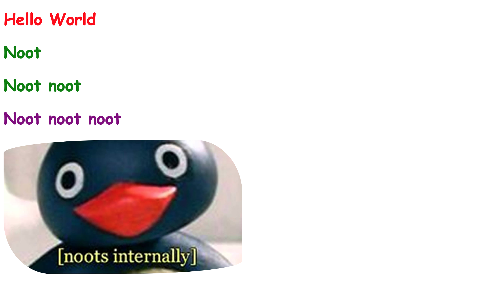
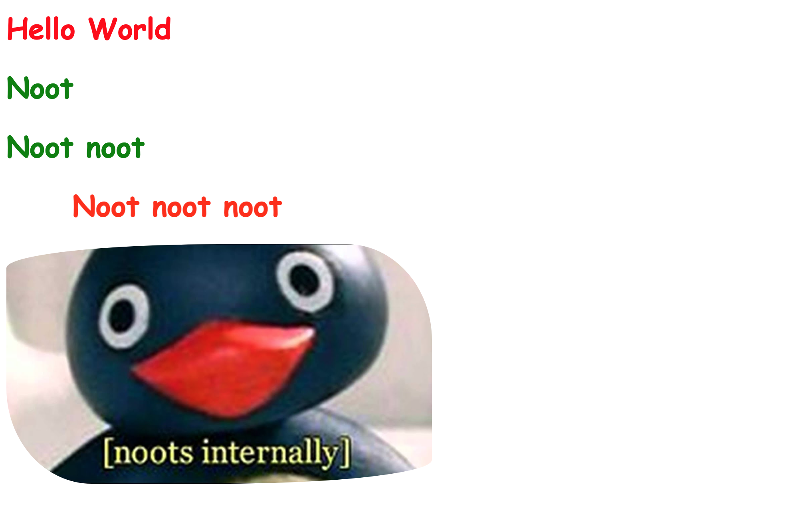
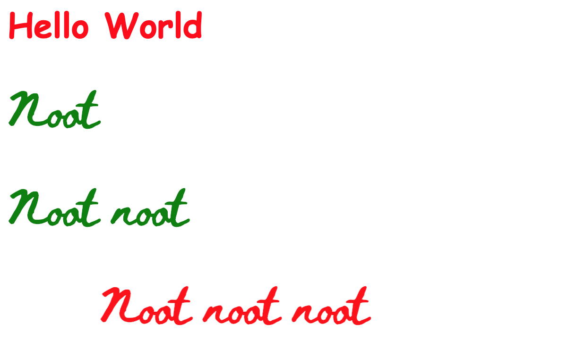
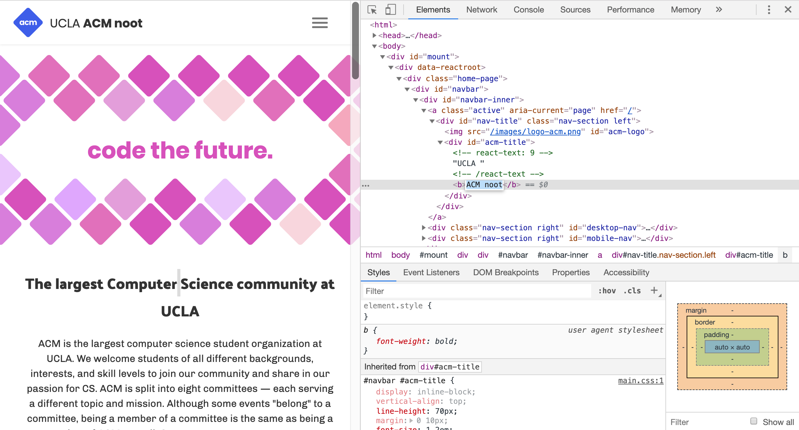

# HackSchool Session 1: Introduction to Web Development
**Location**: Covel 227
**Time**: 6-8pm

**Teachers**
* Kristie Lim
* Prateek Singh

# Resources

**Slides**
* [Session 1 - Introduction to Web Development](http://tinyurl.com/hackschool2018-1)

**ACM Membership Attendance Portal**
* [Portal](http://members.uclaacm.com/login)

**Questions**
* [Ask your question here!](http://goo.gl/forms/xyeFXLx9mrAXolCG3)

# What we'll be learning today

* Basic Dev Environment Setup
* Basic Web Structure
  * Frontend
  * Backend
* HTML
* CSS

## Basic Dev Environment Setup
### 1. Browser with a debugger
Get [Google Chrome](https://www.google.com/chrome/).

### 2. Text Editor
There is NO best editor for everyone. There is only the best editor for yourself.
Here are some common ones that people use.

Get [Sublime Text](https://www.sublimetext.com/).

Get [VS Code](https://code.visualstudio.com/).

Get [Atom](https://atom.io/).

## What happens when you type a URL and hit enter?
Let's say Tim made this fantastic webpage that he wants to share with the world.  


So he puts the code for his webpage on a computer that's always running. This computer can **serve** your page whenever a **client** computer requests it. An example of a client in this situation could be your personal laptop, and an example of a server in this situation could be an AWS server in Arizona.  


How does your laptop know which server to ask for the webpage from? All computers have an address called an IP address. Think of it as a mailing address for computer. Each **domain name** (for example, helloworld.com) corresponds to an IP address to a server. So when you type in a [domain name](https://dyn.com/blog/dns-why-its-important-how-it-works/) from your computer, you are making a request to a server with that corresponding address.


*These not actually the words computers use to communicate. The words that computers actually use to communicate is called a "protocol," and the protocol that web browsers and servers use to communicate is called HTTP or [HyperText Transfer Protocol](https://www.lifewire.com/hypertext-transfer-protocol-817944)*  
  
After all of this, you can view the web page on your computer through a browser like Google Chrome.  

In fact we can see this in action using Google Chrome! If you right click on a webpage and select "Inspect," you open Chrome developer tools.    
    
Then navigate to the "Network" tab and hit refresh. All the files that you see have been delivered by the server through the network to the client. Notice in particular the different file types. We'll be learning more about the code in the documents, stylesheets, and scripts that you see here.    

  

For more about what happens when you type a URL in the browser, check out this [article](https://medium.com/@maneesha.wijesinghe1/what-happens-when-you-type-an-url-in-the-browser-and-press-enter-bb0aa2449c1a ).

## What is web development?

Web development is building sites and applications for the World Wide Web. To do this, we need to write code. Computers are just signal processing machines. So we need code to give them descriptions and instructions for what to do.  
  
Developers write code that describes what is shown in the browser--this is what we call "front-end development" or "client-side code." An example of this would be: show bold text that says "Hello World."  
  
Developers also write code that describe what should be sent to the browser (among other things that need to happen before the client sees anything)--this is what we call "back-end development" or "server-side code." An example of this would be: when you go to the endpoint /about, send over the about page. Backend development also includes what to do when the client sends over data. For example, you might want to add that data to a database or process it in some way. 
  
This first session is focused on the basics of front-end. The foundations of front-end development are: HTML, CSS, and JavaScript. 

## HTML (Hyper Text Markup Language)
HTML is just text with some extra tags that describe the **structure** and the **content** of the page. Let's write some HTML!

### HTML Setup
1. Make a new folder.
2. Open the folder in Sublime. File -> Open...
3. Make a new file. File-> New File (shortcut is Ctrl/Cmd n)
4. Save the file as `index.html`. Make sure to save in the folder you just created.

Add the following code:
```HTML
<!DOCTYPE html>
<html>
<head>
	<title>Landing page</title>
</head>
<body>
	// Stuff will go here!
</body>
</html>
```
- `<!DOCTYPE html>` lets the browser know it’s an HTML doc
- `<html>` and `</html>` tags denote where the content of HTML goes
- `<head>` tag includes information that isn’t displayed, such as the title of the webpage
- `<title>` tag defines a title for the page used in the browser toolbar and search results
- `<body>` tag surrounds all visible content. Put all visible content in here.

### **Tag**: Header
```HTML
<h1> HELLO WORLD </h1>
```
><h1> HELLO WORLD </h1>
- A **header** tag can be from `h1`-`h6`, with 1 being the most important/largest, to 6 being the least important/smallest
- Use header tags to express section headers and other important information

### **Pitfall**: New Lines and spaces 

```HTML
<!-- Example 1 -->
<h2>
  HELLO WORLD
</h2>

<!-- Example 2 -->
<h2> HELLO WORLD </h2>

<!-- Example 3 -->
<h2> HELLO      WORLD </h2>
```

- The above code are exactly the same
- New lines and spaces does not matter
  
Explore the following HTML tags on your own!

### **Tag**: Image
```HTML

```
> 

- Use `img` tag to insert image
- the `src` attribute specify a URL to the image, which can be local or online

### **Tag**: Paragraph
```HTML
<p>I am a paragraph</p>
```
> <p>I am a paragraph</p>

### **Tag**: Ordered List
```HTML
<ol>
  <li>First ordered list item</li>
  <li>Second ordered list item</li>
</ol>
```
> <ol> <li>First ordered list item</li> <li>Second ordered list item</li> </ol>

- There is also unordered list with tag `<ul>`. Items are still marked with `<li>`

### **Tag**: Button
```HTML
<button>Click Me</button>
```
> <button>Click Me</button>

### **Tag**: Links
```HTML
<a href="http://acm.cs.ucla.edu/">ACM Website!</a>
```
> <a href="http://acm.cs.ucla.edu/">ACM Website!</a>
- The `href` attribute specifies the URL 

### **Tag**: Inputs
```HTML
<input types="text" placeholder="input stuff here">
```
><input types="text" placeholder="input stuff here">
- The `<input>` tag is used to gather input from users.
- The `types` attribute specifies the type of input. It can be “text”, “number”, or “submit” based on what you want the user to input.


## CSS (Cascading Style Sheet)

HTML should only represent the content. A different language called CSS is used to create rules about *style*. With CSS, you can create rules like "This text should be red." or "There should be 20 pixels between these two elements." or "This navigation bar should stick to the top of the screen."

### **Stylish**: Create and Link your CSS file to HTML
- Create a file named `style.css` and save it to the same folder as your HTML file. Then add the following line to your HTML file in order to link the two:  
```HTML
<!-- Inside the head tag -->
<link rel="stylesheet" type="text/css" href="style.css">
```
- You can also directly put all CSS code in a `<style>` tag. But separating them into two files is cleaner.

### **About Selection**: Class and ID
All HTML tags have the attribute `class` and `id`. These 2 attributes can be used by CSS code to target the element to add style to. For example, let's say we only want to change the styles on the last three headings. We can specify a class named `noot` for these three headings like this in `index.html`:
```HTML
<h1>Hello World</h1>
<h1 class="noot">Noot</h1>
<h1 class="noot">Noot noot</h1>
<h1 class="noot">Noot noot noot</h1>
```
Then in `style.css`, add the following:
```CSS
.noot {
  color: green;
}
```  


Now let's say that we want the very last header to be special and have its own style. We can identify a single element with the `id` attribute. In `index.html`:
```HTML
<h1>Hello World</h1>
<h1 class="noot">Noot</h1>
<h1 class="noot">Noot noot</h1>
<h1 id="last" class="noot">Noot noot noot</h1>
```
Then in `style.css`, add the following:
```CSS
#last {
	color: purple;
}
```
Notice that in CSS, ids begin with a `#` and classes begin with a `.`. Also notice that the style for the id overrides the style for the class. This is part of the "cascading" nature of "cascading style sheets". The difference between a class and an id is that an id should identify just a single element.  


  
Next up is a cool animation thing and more fonts because the default ones are boring. (And here at Hackschool, we like to keep things fun and fresh!)
  
First, let's define an animation named `fire` in `style.css`:
```CSS
@keyframes fire {
	0% {color: red; transform: translate(100px, 0px);}
	50% {color: yellow; transform: translate(0px, 0px);}
	100% {color: red; transform: translate(100px, 0px);}
}
```
This says that at 0% animation completion, the style will be red and translated to the right by 100px. Then at 50% animation completion, the style will be yellow and translated 0px. Lastly at 100% animation completion, the style will be red and translated to the right by 100px again. The animation between the keyframes is automatic. 
  
Now that the animation has been defined, you can use the property `animation`! Let's add the `fire` animation in `style.css` to the element with the id `last`:
```CSS
#last {
	color: green;
	animation: fire 4s ease infinite;
}
```
This means that we give this element an animation that lasts 4 seconds (0% is at 0 seconds, 50% is at 2 seconds, 100% is at 4 seconds), has a speed function of `ease` (read more [here](https://developer.mozilla.org/en-US/docs/Web/CSS/transition-timing-function)), and repeats infinitely.
  


Next we're going to unlock a world of possibilities in fonts with how to use Google fonts! First, search up [Google Fonts](https://fonts.google.com/). Pick a font! Any font!
  
Click the "+" button for the font you have chosen. Then click the black bar in the bottom left and follow the instructions. You will need to add the first snippet to `index.html` and the second snippet in `style.css`.
  


  

  
Try the following on your own!

```CSS
* {
  border: 2px solid aquamarine;
}
```
- We can select everything with the `*` operator


### **Stylish**: Text Properties

```CSS
.header {
  color: blue;
  /* the following are some text-related properties */
  text-align: right;
  font-weight: bold;
}
```
- [`text-align`](https://www.w3schools.com/cssref/pr_text_text-align.asp) defines how the text is aligned.
- try changing `text-align` to `center`/`left`/`justify` and see what happens.
- [`font-weight`](https://www.w3schools.com/cssref/pr_font_weight.asp) defines how thick or thin the text is going to be.

### **Stylish**: Formatting Properties

```CSS
button {
  padding: 10px;
}
```
- The [`padding`](https://www.w3schools.com/css/css_padding.asp) property is used to generate space around an element's content, inside of any defined borders.

```CSS
button {
  /* padding: 10px; */
  /* changed from padding to margin */
  margin: 10px;
}
```
- The [`margin`](https://www.w3schools.com/css/css_margin.asp) property is used to create space around elements, outside of any defined borders.

- Can you see the difference between `padding` and `margin`? `padding` adds space "inside" while `margin` adds "outside".


## JS (JavaScript)

Finally, the last building block of the web! If we want to make our website more interactive, we need to be able to programmatically change the web page and set rules about what happens during certain events. For example, if we wanted to change some text after a button was clicked, we would use JavaScript. Changing something about the page based on a particular event or condition is sometimes referred to as "Manipulating the DOM."

### What is DOM (Document Object Model)? 

The DOM is a representation of the page as an object. 

- Let's check it out in the browser!
- Left click on any page. Click `Inspect`.
- You should see something like this:

Huh? This looks just like HTML. HTML also represents what the page should look like, but it is the source and not the actual DOM. Once you display your page in the browser, you can’t change the HTML source code anymore but you can change the DOM. Let's change some text on the screen using Chrome's Inspect Element. First click the box with a cursor in the upper left corner or use the shortcut Cmd+Shift+C. Then click the element on the page that you want to change. Lastly double click the highlighted and type something out. Your DOM manipulation should show up on the page.



If we refresh, the changes will disappear. This is because we changed the DOM but not the HTML source code. Once we refresh, we reload a fresh copy of the source.

Read more about the DOM [here](https://www.digitalocean.com/community/tutorials/introduction-to-the-dom).

### What is JavaScript?
So that’s cool and all, good for showing your parents your grades and making official websites look silly. But for our website, we can’t just open Chrome developer tools when we want to change the DOM. Instead, we use a language called JavaScript for changing text, changing colors, changing images, anything in the object that represents the page (anything in the DOM).  
  
In the console of Chrome developer tools, we can run JavaScript! The console allows you to print the value of variables. `document` is a variable that represents the DOM. The function `getElementById` allows you to get a particular element from the DOM based on its id. The attribute `onclick` of an element can be set to a function that determines what happens when the element is clicked. The attribute `innerHTML` refers to the text between the tags of an element. In this case, we're setting the `onclick` attribute to a function that sets the element with id 'acm-title' to have the text of 'Secret message.'


These may be new and confusing concepts that we will cover much more throughout Hackschool, but the key takeaway here is to see what JavaScript looks like and how it can be used to programmatically change a webpage. Read more about JavaScript [here](https://developer.mozilla.org/en-US/docs/Learn/JavaScript/First_steps/What_is_JavaScript)

### **Manipulate**: Let's Write Some JavaScript!
- Create a file named `script.js` in the same directory as your HTML file. Then add your script to `index.html`:
```HTML
<!-- Inside the body tag just before the closing-->
	<script src="script.js"></script>
</body>
```
- You can also put all the JavaScript code within the `script` tag and not specify the source. 


### **Manipulate**: Click and Open Sesame

In `script.js`:
```javascript
document.getElementById('last').onclick = () => {
	document.getElementById('last').innerHTML = 'Secret message';
};
```
- The `() => {}` syntax is a fancy way to declare function. Don't worry. We will be covering those later.
- `document` is another global variable that represents the DOM.
- The first line is saying "after the `window` has loaded (`onload`), execute the following function".
- The second and third line means "for the element with id `last` from the DOM (`document`), and when it is clicked (`onclick`), we change its `innerHTML` content to 'Secret message'.

### And that's it!

As a review, let's take a look again at the network tab of Chrome developer tools.


If you look at some of the file types, you'll notice documents, stylesheets, and scripts--all of which we just learned about!

### What's next for Hackschool?
Next week will be an introduction to back-end web development! Afterwards, we'll branch off into front-end and back-end workshops. What's coming up for front-end?
* JavaScript and the DOM
  * If you were confused on the last part of this workshop, we’ll review it in the next front-end workshop and go over more concrete examples.
* CSS Layout
  * Maybe you had trouble centering things or moving elements to a particular position, we’ll go over how CSS is used for layout with flexbox and grid
* React
  * All of the HTML, CSS, and JavaScript we’ve been learning is fundamental to front-end web development, but it is impractical to make complex web applications just by having three files and manually writing all of the HTML, CSS, and JavaScript. Frameworks are used to scale and manage web applications and reduce repetitive work. At the end of Hackschool, we’ll introduce the popular framework React. 
* Dynamic Content with React
  * Right now, we’ve only been making static websites where the text is fixed. We’ll show you how to make content dynamic. For example, maybe you want to display the current weather which will change every time a user comes to your site.

### Challenge
Create the front page of your alter ego as a dinosaur. (Other front pages also acceptable.)
This is an [example](https://kristielim.github.io/kristriceratops/) and its [source code](https://github.com/kristielim/kristriceratops).

The goal of the challenge is to play around and get a feel for HTML, CSS, and JavaScript. We didn’t cover anything in depth, so you’ll probably come across a lot of “Why is this happening??” moments. Those would be good times to ask mentors/submit questions so we can address it in the future. 

The world of web development is really big, and the goal of this workshop was to understand what front-end web development, HTML, CSS, and JavaScript are. It takes a lot longer than just one workshop to learn web development, but we hope to give you a good foundation so you can develop your skills in the future--both throughout this quarter and beyond :)
