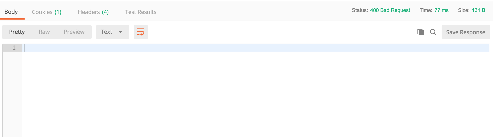

# Hackschool Session 3 Backend: What is an API?
**Location**: Covel 227, UCLA

**Time**: 7:30-8:30pm

**Teachers**
* Galen Wong

## Resources

**Slides**
* [Session 3 - API, HTTP, and JSON](TODO)

**ACM Membership Attendance Portal**
* [Portal](http://members.uclaacm.com/login)

**Install Postman**
* [Install Postman](https://www.getpostman.com/)


## What we'll be learning today
* What is HTTP?
* HTTP Methods
* What is JSON?
* What is an API?

## Goal of today
* Create your own API in node.js


## What is HTTP?

Previously, we talked about typing a URL into the browser. 
We know that we will send a request to a server.
And we also coded a server that returns a HTML page.

However, is that all client and server can do?

Think about the following scenario. 

### The God of Meme
You saw the line in the career fair last week and you would like to make meme about it and post it to the Meme page.


You get your hot meme image ready to post it on Facebook.

You click Post. 

Now, your image is being uploaded to a server. Then, other people can request the server to see the meme that you posted.

We have discovered a new way that client and server can talk to each other.

So apart from client requesting the server for some data, client can also upload data to the server!

But now, server runs into a problem, how does server know client's request is for getting a webpage, or for uploading a meme?

This is where __HTTP__ gets into the picture. 

### HTTP format
HTTP stands for __Hypertext Transfer Protocol__.

The HTTP protocol defines how the request from the client should be formatted, it also defines how the response from the server should be formatted.

A request is just a string that is being sent to the server. The rules set by HTTP allows the server to interpret the string to understand what user wants.


A HTTP request usually comprises 2 parts, __header__ and __body__.

### 1. Header
A header is piece of text (string) that a client sends to a server containing what the user wants from the server.

We can actually see the request inside the developer console in Chrome.

* Right click on any page, click `Inspect`. Or just <kbd>Command Option i</kbd> on Mac, <kbd>Ctrl Shift J</kbd> on Windows.

* Open the networking tab in Developer console.

* Go to `www.google.com`

* Click on the `www.google.com` column on the console.

* Go to `Headers` tab

You can see the Request Header!

It has information about `path`, which specifies which page you want from `www.google.com`.


### 2. Body
If you are uploading images, or text, the body will contain all the data.

## HTTP Methods

One easy way for the server to know whether the client wants a webpage or to upload a file is through the property `method` in the request header.

### GET
We can see from the exmaple above. We performed a `GET` request to the server. 
We are trying to `GET` a webpage. By specifying `GET` in the `method` key in the header, the server will send you back the HTML file.

When you type in the URL, the browser will format the request to the server for you. 

And it will sends it to the server.

### POST
A `POST` method is used usually when we try to upload something, text or file. 

But how do we send a request with a `POST` method? We cannot type in an URL in the browser, since there is no way that we can specify the file/text we want to upload.

`POST` requests are usually done under the hood for you by JavaScript. 

Let's try it out

* Open network tab in Chrome developer console

* Go to hackschool18.azurewebsites.net/upload

* Open the new tab hackschool18.azurewebsites.net to see your message

* Type in your name/messages and click Send

* See the upload in console!


We can see in the request header, we have method as `POST`.

We can also see the `Request Payload`, which is the `body`, containing the message that we send.

```JS
{ message: 'my msg', sender: 'Krisite' }
```

The format looks familiar right?

## What is JSON?

JSON is __JavaScript Object Notation__. We represent data in the JSON format, as we would in JavaScript.

We see from the above example that we can send our data in forms of a JSON. 

Now, an interesting thing is that not only can we request to `GET` a HTML page from the server,
we can also `GET` data from the server in form of JSON. 

Let's try it out.

Here is an URL that we can use to `GET` some cat facts. 

```
cat-fact.herokuapp.com/facts/random
```
It returns a JSON!

## Postman

Great, we now know we can get data from `GET` request as well. 
Let me introduce you to a fantastic software to do testing on HTTP requests.

In Postman, you can make `GET`/`POST` request. 

Let's try to `GET` a webpage. 
```
www.example.com
```

We can see that it sent us back some HTML. We can preview it using the `preview` tab.


Let's try with the cat fact example again.

```
cat-fact.herokuapp.com/facts/random
```

Now, we know that we cannot do `POST` request with a browser. Postman can do that for us. 

* Put `hackschool18.azurewebsites.net/message`
* Select `POST` next the URL field
* Choose the `body` tab  
* Select `raw` and choose `JSON (application/json)`
* Type the following
* Open the new tab hackschool18.azurewebsites.net to see your message

```JS
{
  "message": "my msg",
  "sender": "Krisite"
}
```

Now, we click send. Magic happens!

Notice that Postman automatically sets one property in the header. 

```
Content-Type: application/json
```

`Content-Type` in header tells the server what is inside our `body`, then server knows how to interpret/understand the body string.
In this case, the server will interpret the body string as a JSON/JavaScript object. 

Also notice that we get a JSON response back.
```JS
{
    "status": "Success!"
}
```
This means that in a POST request, although we are uploading things, server can still send stuff back too!
If the server wants, it can send back a HTML page. 

### What is under the hood in browser?

When we click the `send` button in browser to send a message, the JavaScript code underneath does exactly what we did in Postman. 
It formatted the request header and body, and send it to the server using the URL.

## HTTP Status Code
Ok, let's say you are uploading a message. How do you know that your message got successfully uploaded?

Then, the __repsonse__ is going to help us!

A HTTP response is just like a request. 
It has __header__ and __body__.


In `header`, there is a field called `status` containing a number. That number indicates if your request was successful.

```
2XX: The request was successful
4XX: The request was not successful and client probably messed up.
5XX: The request was not successful and server probably messed up.
```

In `body`, it will conatins whatever data is sent back. 
It can be JSON/HTML or even random string of text, or nothing at all.


Let's check the Chrome developer console and go to `www.google.com`.

* We can find `status` in the `Response Header` tab under the `Header` section.
* We can also see the `Response` tab to see what is contained in the body
* The `Preview` tab provides a prettier view of the `body` data.

We can do this in Postman as well.

Let's send a message to `hackschool18.azurewebsites.net/message` but without body.

We can see the error code, and nothing is being returned. 



## What is an API?
API stands for __Application Programming Interface__.
An API is a definition of methods of communication among various 'components'. 


How is it different from HTTP then? 
* HTTP defines how computer talk to each other over the world wide web. 
* A web API defines how frontend code communicates with backend code.


It is pretty abstract but don't worry. As you get more and more experience, you can tell what is an API.

In the web context, API usually refers to endpoints that we can call to retrieve some data. For example, the cat facts endpoint is an API to retrieve JSON data of, well, cat facts.

It is an API because we __HAVE TO__ use a GET method to make a request to the specific URL. 
There are restrictions to how we can talk to the server. Therefore it is an API.

Moreover, the URL to POST a message we just did was also an API. 

It is an API because we __HAVE TO__ use a POST method to make a request to the specific URL. 
And we also have to make sure we have a JSON object in the body that has the key `sender` and `messsage`/
There are rules to how we upload a message. Therefore, it is an API.


## Write your own API

Setup:
* Make a folder
* npm init
* install express
* Start a server. 

```bash
$ pwd
/Users/galenw/Desktop
$ mkdir myAPIserver
$ cd myAPIserver
$ npm init
# ...
$ npm install --save express
# ...
$ touch server.js
```

Inside `server.js`

```JS
const express = require('express');
const app = express();
```

Let's make an endpoint to return some random number in JSON. 

```JS
app.get('/random', (req, res) => {
    let myJSON = {};
    myJSON.number = Math.random();
    // myJSON at this point should look like this
    // { "number": 123 }
    res.json(myJSON);
});

app.listen(8080);
```
* the `res.json` function allows us to pass in an object and express will send it back to the user.
* `Math.random` is a built in function to generate a random number.


We do a `GET` to `localhost:8080/random` in Postman.

However, what happens when we do a `POST` on that URL?

We get a 404 Not Found. Reason is that we only defined what will happens when a `GET` request is made to the endpoint with the `app.get` function, not a `POST` request.


Let us write an endpoint that receives something from the user. 
Since user would be 'uploading' some data, we use the `POST` method with the `app.post` function.

```JS
app.use(express.json());
```
This line tells express that the input body might contain JSON object. If express sees a string that is in JSON format in `body` it will transform it into an actaul JavaScript Object.

```JS
app.post('/name', (req, res) => {
    const message = req.body();
    if(message["name"] == undefined) {
        res.status(400);
        const wrong = {
            message: "Input JSON does not contain key 'name'"
        };
        res.json(wrong);
        
    } else {
        const sayHi = 'Hello ' + message.name;
        console.log(sayHi);
        const resJSON = {
            message: sayHi
        }
        res.json(resJSON);
    }
})
```
* `app.post` specifies that this endpoint takes a `POST` request.
* `req.body` contains the JSON in the `body` of the **req**uest.
* We used a if-statement to check if the `name` key exists in the body.
* If no, we return a JSON saying the input is invalid with status code 400.
* `res.status` helps us to set the `status` in the response header.
* If it does contain `name`, we return a message saying hello. 


Let's test it with Postman.
* Put `localhost:8080/name`
* Select `POST` next the URL field
* Choose the `body` tab  
* Select `raw` and choose `JSON (application/json)`
* Type the following
```JS
{
	"name": "Galen"
}
```

What if we put some other fields in? Like
```JS
{
    "name": "Galen",
    "age": 18
}
```
We still get the correct behavior since we did not check for if the JSON contains extra fields.

What if we remove the `name` key?
```JS
{
    "age": 18
}
```

Now we get an error with status code `400`!

There you go, you have written your first API!

