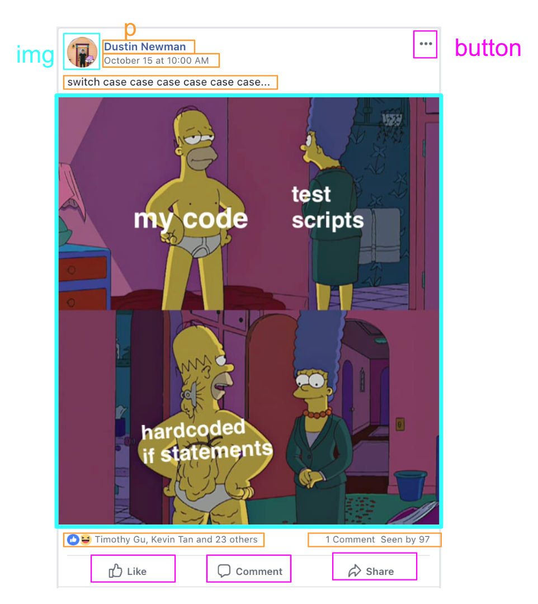
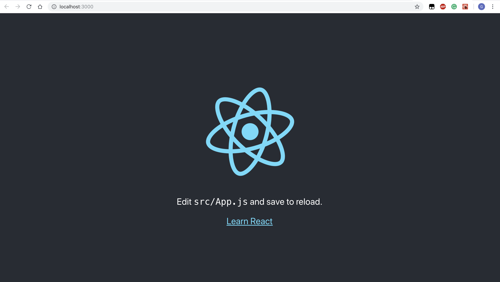
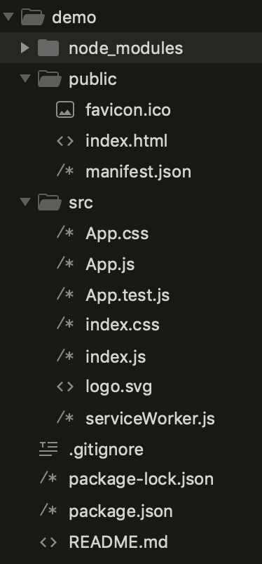
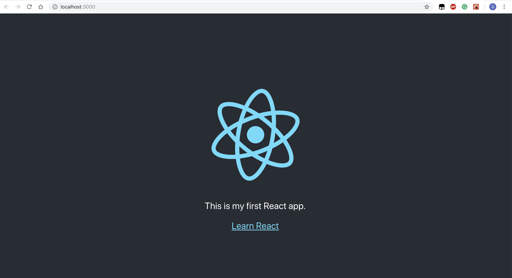

# Hackschool Session 5 Frontend: React
**Location**: Covel 227  
**Time**: 6:15–7:15pm, 7 November 2018

**Teacher**: Galen Wong 

## Resources

**Slides**
* [Session 5 Frontend: React](TODO)

**ACM Membership Attendance Portal**
* [Portal](https://members.uclaacm.com/login)

## What we'll be learning today

* `Class` in JavaScript
* React


## Motivation of React
HTML elements are the basic building blocks of web pages.
Even the most complex and large web applications are built on simple tags like `h1`, `img`, `p`, `button` etc.

For instance, a typical Facebook post looks like this.



All the things in the post are very basic HTML elements. It can possibly be represented like this.

```html
<div>
    
    <p> Dustin Newman </p>
    <button> … </button>

    <p> switch case case … </p>

    

    <p>Timothy Gu, Kevin Tan, and 23 others </p>
    <p>1 Comment Seen by 97</p>

    <button> Like </button> 
    <button> Comment </button> 
    <button> Share </button>
 </div>
```


However, on your Facebook feed, there are always multiple posts. They all inherit a similar structure. There is a user name, user profile picture, time of posting, "like", "comment", and "share" buttons, etc.


To code out multiple posts, we would have to copy and paste. There is repeated code. We don't like that.


What if we can define a complex html tag? A tag that can encapsulate the structure of a Facebook Post and we only worry about its content?


```html
<!-- Imagine a complex tags that looks like this -->
<MyPostTag 
	profile="profile.png"
	name="Dustin Newman"
	date="October 15 at 10:00AM"
	text="switch case case case..."
	image="meme.png"
	reax="Timothy Gu, Kevin Tan and 23 others"
	comments="1 Comment"
	seen="Seen by 97"
/>
```

That is exactly what React enables you to do. You can define your own HTML-like tags that can be accessed through JavaScript. These are called **components**.

Once you define a component, you can easily reuse it.

```html
<!-- First Post -->
<MyPostTag 
	profile="profile1.png"
	name="Galen"
	date="November 7 at 10:00AM"
	text="I love react"
	reax="Timothy Gu, Kevin Tan and 23 others"
	comments="1 Comment"
	seen="Seen by 97"
/>
<!-- Second Post -->
<MyPostTag 
	profile="profile2.png"
	name="Tim"
	date="November 7 at 6:00PM"
	text="I love react"
/>
```

## `Class` in JavaScript

Before we dive into React, we have to learn the syntax of **Class** in JavaScript.

### Declare a class
```js
class Person {
    constructor(name, age) {
        this.name = name;
        this.age = age;
    }
    
    sayHello() {
        console.log('Hi, my name is ' + this.name);
    }

    changeAge(newAge) {
        this.age = newAge;
        console.log(this.name + ' is now ' + this.age + ' yo.')
    }
}
```

* The `constructor` function is a function called when we create a new *instance* of a class. An instance is an object based on the format of the class definition.
* `constructor` usually defines the proterties of instance within the class too.
* `this.name` and `this.age` are both properties in both instances of class `Person` 
* `sayHello` and `changeAge` are both function within the instances. 
* The `this` keyword specifies that it is referring to itself, the instance of the class.


### Use a class
```js
// Inside a JavaScript Interactive Environment 
// (e.g. Chrome DevTools)
let me = new Person("Galen", 18);
me
// Output: Person {name: "Galen", age: 18}
me.sayHello();
// Output: Hi, my name is Galen.
me.changeAge(19);
// Output: Galen is now 19 yo.
me
// Output: Person {name: "Galen", age: 19} 
let berg = new Person("berg", 105);
berg
// Output: Person {name: "berg", age: 105}
me
// Output: Person {name: "berg", age: 19}
berg.changeAge(100);
berg
// Output: Person {name: "berg", age: 100}
me
// Output: Person {name: "berg", age: 19}
```
Changing the age of `berg` will not change the age of `me`.

We can see that the `this` keyword specifies which person's age we are changing, namely the "current object/instance" itself.


## Set up React
Make sure you have **node.js** installed.

Execute this in your terminal/CMD.
```shell
npx create-react-app demo
cd demo
npm start
```
`npx` is a node package runner. 
It runs a package called `create-react-app`.
It creates a react web app in a directory `demo`.

This sets up a react web app for you with everything. 
To access the page, go to __localhost:3000__.



Now, let's check our `demo` directory




The only html file in the directory is __index.html__.
Let's check out 3 files: __index.html__, __App.js__, __index.js__.

```html
<!-- index.html -->
<head>
    <!-- scripts -->
</head>
<body>
    <noscript>
        You need to enable JavaScript to run this app.
    </noscript>
    <div id="root"></div>
    <!-- comments.... -->
</body>
```

We see the body contains nothing. Then, why is it showing the page with text and images?

Let's check `App.js`.

```jsx
class App extends Component {
  render() {
    return (
      <div className="App">
        <header className="App-header">
          
          <p>
            Edit <code>src/App.js</code> and save to reload.
          </p>
          <a
            className="App-link"
            href="https://reactjs.org"
            target="_blank"
            rel="noopener noreferrer"
          >
            Learn React
          </a>
        </header>
      </div>
    );
  }
}
```
The syntax is extremely weird. 
It looks like a mix of JavaScript and HTML. 
This syntax is called __JSX__, which is JavaScript-XML.
XML is kind of similar to HTML but slightly different. See [here](http://courses.cs.vt.edu/~cs1204/XML/htmlVxml.html).
JSX is made to make writing React easier.

However, __JSX is not JavaScript__. You cannot execute or write JSX in your browser. It is only allowed in React.

`App` is a complex React component containing multiple simple HTML tags.


Also, notice the `import` statements. It imported `App.css` and if you check that file, we can see the styling applied to the page.

Well, how does it get loaded into the HTML page? Let's check `index.js`


```jsx
import React from 'react';
import ReactDOM from 'react-dom';
import './index.css';
import App from './App';
import * as serviceWorker from './serviceWorker';

ReactDOM.render(<App />, document.getElementById('root'));

// If you want your app to work offline and load faster, you can change
// unregister() to register() below. Note this comes with some pitfalls.
// Learn more about service workers: http://bit.ly/CRA-PWA
serviceWorker.unregister();
```

It imported `App`, which is the `App.js` file in the the same directory. 
Notice that we did not specify the file type of `App`.
JavaScript assumes that you will be using `.js` file by default.

Look at the line
```jsx
ReactDOM.render(<App />, document.getElementById('root'));
```

`ReactDOM.render` function takes in 2 things, a React Component that we defined, and an element from the page. 

What it does is that it calls the `render` function of the `App` Component, 
and replace the element with id=`root` with whatever HTML is returned from `render`.

That means that if we change `App`, it changes whatever is shown in the page.

Let's try to modify `App`
```jsx
  render() {
    return (
      <div className="App">
        <header className="App-header">
          
          <p>
            {/*Edit <code>src/App.js</code> and save to reload.*/}
            This is my first React app.
          </p>
          <a
            className="App-link"
            href="https://reactjs.org"
            target="_blank"
            rel="noopener noreferrer"
          >
            Learn React
          </a>
        </header>
      </div>
    );
  }
```
After you save the file, your browser should refresh automatically.




Fantasic. Let's go ahead and delete all the stuff in `App` and start our own app.

Let's make a twitter app for yourself. 

Let's define a "tweet". 

```jsx
class Tweet extends React.Component {
  render() {
    return (
    <div>
      <p> I love Rende. </p>
      <br/>
      <button>❤️</button>
    </div>
    );
  }
}
```

Let put `Tweet` into `App` so we can see it.

```jsx
class App extends Component {
  render() {
    return (<Tweet />);
  }
}
```

See that we can use our defined components in `App`.
We can actually pass in our text for the tweet with something called __props__.

```jsx
class Tweet extends React.Component {
  render() {
    return (
    <div>
      <h2> {this.props.tweet} </h2>
      <button>❤️</button>
    </div>
    );
  }
}

class App extends Component {
  render() {
    return (<Tweet tweet="I love Rende. "/>);
  }
}
```

This `tweet` looks like attribute in HTML.
e.g. `<h1 id="title">`.

Whatever "attributes" are being passed into `Tweet` would be store in an object called `props`. You can access it through `this.props`. 

Notice another thing. `this.props.tweet` is a JavaScript syntax in a bunch of HTML codes. 
We make clear that it is JavaScript by surrounding it with `{ }`.

Let's render multiple tweets.

```jsx
class App extends Component {
  render() {
    return (
      <div>
        <Tweet tweet="I love Rende. "/>
        <Tweet tweet="I love Covel. "/>
        <Tweet tweet="I hate BPlate. "/>
      </div>
    );
  }
}
```

We can actually uses an array to help us store these tweets.

```jsx
class App extends Component {
  render() {
    const tweets = ["I love Rende", "I hate BPlate"];
    const lists = tweets.map((text) => <Tweet tweet={text} />);
    return (
      <div>
        {lists}
      </div>
    );
  }
}
```
`map` is a function of array. It iterates through the array `tweets`, 
and form a new array with each element defined by the function we passed to `map`.
In this case, we passed in `(text) => <Tweet tweet={text} />`. 
`text` represents each elements. 
It returns a `Tweet` component with `tweet` set to `text`.


This was the __reuse__ part of React. 
We reuse the component `Tweet` without worrying the structure inside `Tweet`.

### State

Another important concept in React is __state__.
Let's add a counter next to the button.

```jsx
class Tweet extends React.Component {
  constructor() {
    super();
    this.state = {
      numLike: 0
    };
  }

  render() {
    const numLike = this.state.numLike;
    return (
      <div>
        <h2>{this.props.tweet}</h2>
        <button>❤️ {numLike}</button>
      </div>
    );
  }
}
```
In `constructor`, we set a variable `state` to hold an object with a key `numLike`. 

We accessed the state using `this.state` in `render`.

What is `super()`? 
To understand this, you will have to know what __inheritance__ is in 
[Object Oriented Programming](https://searchmicroservices.techtarget.com/definition/object-oriented-programming-OOP).
It initializes the parent class `React.Component`.

We want to increment the `this.state.numLike` everytime we click the button. Let's define a function to do that.


```jsx
class Tweet extends React.Component {
  constructor() {
    super();
    this.state = {
      numLike: 0
    };
    this.buttonOnClick = () => { this.incrementLike(); };
  }

  incrementLike() {
    const previousLike = this.state.numLike;
    const newState = {
        numLike: previousLike + 1
    };
    this.setState(newState);
  }

  render() {
    const numLike = this.state.numLike;
    return (
      <div>
        <h2>{this.props.tweet}</h2>
        <button onClick={this.buttonOnClick}>❤️ {numLike} </button>
      </div>
    );
  }
}
```
There are 3 things that we changed.
1. We defined the `incrementLike` function. 
Instead of directly assigning a new object to `this.state`, 
2. we used a function `this.setState` to help us set state.

3. We set the `onClick` attributes to a function `this.buttonOnclick`.
The function is being defined in the constructor `() => { this.incrementLike(); }`
This means whenever the button is clicked. It will call a function which calls `incrementLike`.

Save and check your page. Now your like button should work.


### Accessibility in React
At this point, you might have noticed that React has been yelling at us all the time for some warning like
```
Line 24:  Emojis should be wrapped in <span>, have role="img", and have an accessible description with aria-label or aria-labelledby
```
telling us we should wrap our emoji in a `span` tag. 

The reason for doing this is for accessibility. 

>To a person using a screenreader, however, he/she may not be aware that this content is there at all. By wrapping the emoji in a <span>, giving it the role="img", and providing a useful description in aria-label, the screenreader will treat the emoji as an image in the accessibility tree with an accessible name for the end user.

src: [accesible-emoji](https://github.com/evcohen/eslint-plugin-jsx-a11y/blob/master/docs/rules/accessible-emoji.md)

Let's go ahead and make it more user-friendly!

```jsx
render() {
  const numLike = this.state.numLike;
  return (
    <div>
      <h2>{this.props.tweet}</h2>
      <button onClick={this.buttonOnClick}>
        <span role="img" aria-label="Love">❤️</span> {numLike}
      </button>
    </div>
  );
}
```

You might also wonder why we are keeping data in `state`?
Can we instead just keep `numLike` in the class like `this.numLike` instead of `this.state.numLike`?
`this.state` is a specially reserved class variable in a React component. 
It is responsible to keep track of the data that we display on the webpage. 
And we are using `setState` to update it so that React knows the data on the page changed so it needs to call `render` again. 

**`state` is a super duper important concept in React.** 
Make sure you understand it well. 


### Input and State
Let's add an input box so you can add new tweet from your app

```jsx
class App extends Component {
  constructor() {
    super();
    this.state = {
      tweets: [],
      currTweet: ''
    };
    this.tweetIndex = 0;
    this.inputOnChange = (e) => { this.updateCurrTweet(e); };
    this.buttonOnClick = () => { this.addTweet(); };
  }

  updateCurrTweet(event) {
    const newState = {
      currTweet: event.target.value
    };
    this.setState(newState);
  }

  addTweet() {
    if (this.state.currTweet === '') {
      alert('Input something first');
      return;
    }
    const currTweetObj = {
      index: this.tweetIndex,
      content: this.state.currTweet
    };
    this.tweetIndex += 1;

    const prevTweets = this.state.tweets;
    const newTweets = [currTweetObj, ...prevTweets];
    const newState = {
      tweets: newTweets,
      currTweet: ''
    };
    this.setState(newState);
  }
  render() {
    const tweets = this.state.tweets;
    const lists = tweets.map((tweetObj) => <Tweet tweet={tweetObj.content} key={tweetObj.index} />);
    return (
      <div>
        <input value={this.state.currTweet} onChange={this.inputOnChange}/>
        <button onClick={this.buttonOnClick}>tweet</button>
        {lists}
      </div>
    );
  }
}
```

Let's first look at `updateCurrTweet`. We passed `(e) => this.updateCurrTweet(e)` to `onChange` attribute of `input` tag. 
Everytime we type in the input box, it calls the function and passes in an "event" object, which holds information about the "change" event.
We can access the value of the event's target, which is the input box. 
We take that value and put that in the state in `updateCurrTweet`. 

Notice how we set the `value` attribute of the input tag to `this.state.currTweet`. It means whatever is in `currTweet` will be displayed in the input box.

Now, we examine the `addTweet` function. 

We represent each tweet as an object with a number `index` and the content of the tweet `content`. 

It pushes a new tweet to the beginning of `this.state.tweets` array and update the state.

The strange operator `...` is to expand/_spread_ an array. 
What does it mean? 
Since `prevTweets` is an array, we expand it inside `[ ]` for JavaScript to know that we are trying to take all elements in the `prevTweets` and put it after `currTweetObj`.

Why do we use an object to represent a tweet then? 
Shouldn't a string itself be enough?
Why are we keeping an index?
We see that we pass the index to an attirbute `key` in `Tweet`. 
This is neccessary so that React can distinguish element from each other. 


There you have it. A working twitter.

Does this look good? Not at all. It needs some serious styling. But due to limited time. We cannot teach you how to style in React.
However, __CSS stills works in React__. Please look it up online and try to apply CSS to React.

Maybe you can start [here](https://reactjs.org/docs/faq-styling.html#how-do-i-add-css-classes-to-components) and [there](https://codeburst.io/4-four-ways-to-style-react-components-ac6f323da822).

